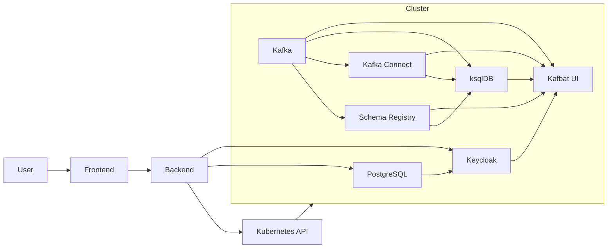

# StreamLink

> **⚠️ IN PROGRESS**: This project is under active development. Features and documentation may change frequently.

A unified open-source tool for end-to-end event orchestration and Kubernetes service management. StreamLink provides a single control plane for managing Kafka, Schema Registry, PostgreSQL, Keycloak, and other services with integrated authentication, encryption, and dependency-aware deployment.

## Features

- 🔐 **OAuth2 Authentication** - Keycloak integration with PKCE flow
- ☸️ **Kubernetes Management** - Multi-cluster support with encrypted kubeconfig storage
- 🚀 **Service Deployment** - One-click deployment of services with automatic dependency resolution
- 📊 **Health Monitoring** - Real-time service status and pod health tracking
- 🔒 **Security First** - Fernet encryption for sensitive data, auto-generated passwords
- 💻 **Modern UI** - React-based dashboard with service management

## Tech Stack

**Backend**:
- FastAPI 0.104.0 (Python async web framework)
- SQLAlchemy 2.0 + asyncpg (PostgreSQL ORM)
- Kubernetes Python client 28.1.0
- Cryptography 41.0.7 (Fernet encryption)

**Frontend**:
- React 18.2.0 + React Router 6.20.0
- Parcel 2.10.3 (bundler)

**Services** (deployed via Kubernetes):
- PostgreSQL 15 (application database)
- Keycloak 23 (identity provider)
- Apache Kafka (event streaming)
- Schema Registry (schema management)
- Kafka Connect, ksqlDB, Kafbat UI

---

## Architecture Overview



### Automatic Service Wiring
- **Dependency-aware deployments**: Each service discovers existing endpoints via ConfigMaps and environment expansion.
- **Keycloak issuer**: Kafbat UI reads Keycloak external host/port and computes its issuer URL automatically.
- **Kafka integrations**: Schema Registry, Kafka Connect, and ksqlDB auto-bind to Kafka using published cluster endpoints.
- **Zero manual glue**: As you add deployments, they connect to what’s already running—no extra configuration needed.

# Development Guide

## Prerequisites

- **Kubernetes Cluster** - For deploying services
- **Python 3.11+** - Backend runtime
- **Node.js 18+** - Frontend runtime
- **kubectl** - Kubernetes CLI tool

## Quick Start

### 1. Clone Repository

```bash
git clone <repository-url>
cd StreamLink
```

### 2. Setup Environment Variables

Create `.env` with only one variable: `ENCRYPTION_KEY`.

```bash
# Generate a key, then paste it into .env
python3 -c "from cryptography.fernet import Fernet; print(Fernet.generate_key().decode())"
echo "ENCRYPTION_KEY=<paste-generated-key-here>" > .env
```

All other service configuration is handled internally by StreamLink and stored in `backend/src/config.py`. You do not need to edit it.

### 3. Deploy Services to Kubernetes

StreamLink deploys all services (PostgreSQL, Keycloak, Kafka, etc.) to your Kubernetes cluster through the UI.

1. Start the backend and frontend (see next section)
2. Add your Kubernetes cluster via the UI
3. Deploy services in order:
   - PostgreSQL (database)
   - Keycloak (authentication)
   - Kafka → Schema Registry → Kafka Connect → ksqlDB → Kafbat UI

The system auto-generates passwords and handles dependencies automatically.

### 4. Post-Deployment: Create a Keycloak User (Manual)

> StreamLink initializes the `streamlink` realm and required clients automatically. You only need to create a login user.

1) Retrieve the Keycloak admin password from Kubernetes:

```bash
kubectl -n streamlink get secret keycloak-secrets \
   -o jsonpath='{.data.admin-password}' | base64 --decode; echo
```

Admin username: `admin`

2) Access the Keycloak Admin Console:
- Option A (NodePort): `http://<node-ip>:30081/admin`
   - Find node IP: `kubectl get nodes -o wide`
- Option B (local port-forward):

```bash
kubectl -n streamlink port-forward svc/keycloak 8080:8080
# Then open http://localhost:8080/admin
```

3) Create a user in the `streamlink` realm:
- Top-left realm selector → choose `streamlink`
- Users → Add user → set `username`
- Credentials → Set password → disable `Temporary` → Save

You can now log in to StreamLink with this user.
### 4. Run Backend

```bash
cd backend
bash dev.sh
```

This script will:
- Create a Python virtual environment (if needed)
- Install dependencies from `requirements.txt`
- Load environment variables from `.env`
- Run database migrations
- Start FastAPI server on http://localhost:3000 with hot-reload

**Backend will be available at**: http://localhost:3000

**API Documentation**: http://localhost:3000/docs (Swagger UI)

**Backend Logs**: Watch the terminal for logs

### 6. Run Frontend (New Terminal)

Open a new terminal window/tab:

```bash
cd frontend
bash dev.sh
```

This script will:
- Install Node.js dependencies (if needed)
- Start Parcel dev server with hot-reload

**Frontend will be available at**: http://localhost:3001

**Note**: The first build may take a minute. Subsequent builds are instant.

### 7. Test the Application

1. Open http://localhost:3001 in your browser
2. Click **"Login"** button
3. You'll be redirected to Keycloak
4. Log in with the user you created in the `streamlink` realm
5. After successful login, you'll be redirected to the dashboard
6. You should see:
   - User info in the sidebar
   - Dashboard home page
   - Kubernetes menu (if you add a cluster)
   - Services menu (after cluster is connected)

---

## Configuration Management

StreamLink separates **secrets** from **configuration** for security:

### Configuration Files

| File | Purpose | In Git? |
|------|---------|---------|
| `.env` | Encryption key only (`ENCRYPTION_KEY`) | ❌ No (gitignored) |
| `backend/src/config.py` | Internal application/service configuration | ✅ Yes |
| `backend/deployments/*.yaml` | Kubernetes manifests | ✅ Yes |

### What Goes Where?

**`.env`**:
```bash
ENCRYPTION_KEY=<generated-key>
```

**`backend/src/config.py`**:
- Contains all other configuration (service defaults, OAuth, issuer URIs, etc.)
- Managed by StreamLink; no manual edits required

---

## Project Structure

```
StreamLink/
├── .env                       # Secrets (gitignored)
├── .env.example              # Template
├── README.md                 # This file
│
├── backend/
│   ├── dev.sh               # Backend development script
│   ├── requirements.txt     # Python dependencies
│   ├── deployments/         # Kubernetes YAML manifests
│   │   ├── postgres.yaml
│   │   ├── keycloak.yaml
│   │   ├── kafka.yaml
│   │   ├── schema-registry.yaml
│   │   ├── kafka-connect.yaml
│   │   ├── ksqldb.yaml
│   │   └── kafbat-ui.yaml
│   └── src/
│       ├── main.py          # FastAPI application
│       ├── config.py        # Configuration
│       ├── database.py      # Database connection
│       ├── models/          # SQLAlchemy models
│       │   ├── user.py
│       │   ├── cluster.py
│       │   └── service.py
│       ├── api/             # API endpoints
│       │   ├── auth_simple.py
│       │   ├── clusters.py
│       │   └── services.py
│       └── utils/
│           └── crypto.py    # Encryption utilities
│
├── frontend/
│   ├── dev.sh               # Frontend development script
│   ├── package.json         # Node.js dependencies
│   ├── index.html           # Entry point
│   └── src/
│       ├── App.jsx          # React router
│       ├── pages/
│       │   ├── LoginSimple.jsx
│       │   ├── DashboardSimple.jsx
│       │   ├── Clusters.jsx
│       │   └── Services.jsx
│       └── components/      # Reusable components
│
└── deployments/             # Kubernetes manifests
    ├── postgres.yaml        # PostgreSQL StatefulSet
    ├── keycloak.yaml        # Keycloak Deployment
    ├── kafka.yaml           # Kafka broker
    └── ...                  # Other service manifests
```

---

## Development Workflow

### Starting Development

```bash
# Terminal 1: Backend
cd backend && bash dev.sh

# Terminal 3: Frontend
cd frontend && bash dev.sh
```

### Making Changes

**Backend Changes**:
- Edit files in `backend/src/`
- FastAPI auto-reloads on file changes
- Check terminal for errors

**Frontend Changes**:
- Edit files in `frontend/src/`
- Parcel auto-reloads on file changes
- Browser will refresh automatically

**Database Schema Changes**:
```bash
cd backend
source venv/bin/activate
alembic revision --autogenerate -m "description"
alembic upgrade head
```

### Stopping Services

```bash
# Stop backend: Ctrl+C in backend terminal

# Stop frontend: Ctrl+C in frontend terminal

# Clean up Kubernetes resources (if needed)
kubectl delete namespace streamlink
```

---

## Common Development Tasks

### Add a Kubernetes Cluster

1. Log in to the application
2. Go to **"Kubernetes"** page
3. Click **"Add Cluster"**
4. Fill in:
   - **Cluster Name**: `my-cluster`
   - **API Server**: Your K8s API endpoint
   - **Kubeconfig**: Paste your kubeconfig content
5. Click **"Add Cluster"**

The kubeconfig is encrypted with Fernet before storing in the database.

### Deploy a Service

1. Ensure a cluster is connected
2. Go to **"Services"** page
3. Deploy services in dependency order:
   - PostgreSQL (database for StreamLink)
   - Keycloak (authentication, depends on PostgreSQL)
   - Kafka (event streaming)
   - Schema Registry (depends on Kafka)
   - Other services as needed
4. Passwords are auto-generated and logged to backend console
5. Service status updates in real-time

### Check Logs

**Backend Logs**: Check the terminal where `dev.sh` is running

**Frontend Logs**: Check browser console (F12 → Console)

**Kubernetes Pod Logs**:
```bash
kubectl logs -n streamlink <pod-name>
kubectl logs -n streamlink -l app=postgres
kubectl logs -n streamlink -l app=keycloak
```

### Database Access

**Connect to PostgreSQL** (once deployed to Kubernetes):
```bash
kubectl port-forward -n streamlink svc/postgres 5432:5432
psql -h localhost -U streamlink -d streamlink
# Use the generated password from deployment logs
```

**Useful Queries**:
```sql
-- Check users
SELECT * FROM users;

-- Check clusters
SELECT id, name, api_server, status FROM clusters;

-- Check services
SELECT id, name, namespace, status, replicas FROM services;
```

### Reset Keycloak Session

If you're stuck with wrong user or session issues:

```bash
# Clear browser data
# Press F12 → Application → Storage → Clear site data
---

## Troubleshooting

### Backend won't start

**Error: "Missing ENCRYPTION_KEY"**
```bash
python3 -c "from cryptography.fernet import Fernet; print(Fernet.generate_key().decode())"
# Add output to .env as ENCRYPTION_KEY
```

**Error: "Connection refused" (PostgreSQL)**
- PostgreSQL must be deployed to Kubernetes first
- Check pod status: `kubectl get pods -n streamlink`
- Check logs: `kubectl logs -n streamlink -l app=postgres`
- Port forward to test: `kubectl port-forward -n streamlink svc/postgres 5432:5432`

**Error: "Module not found"**
```bash
cd backend
source venv/bin/activate
pip install -r requirements.txt
```

### Frontend won't start

**Error: "Command not found: npm"**
- Install Node.js 18+ from https://nodejs.org

**Error: "Port 3001 already in use"**
```bash
lsof -ti:3001 | xargs kill -9  # Kill process on port 3001
```

**Error: Dependencies not installing**
```bash
cd frontend
rm -rf node_modules package-lock.json
npm install
```

### Keycloak issues

**Can't access Keycloak**
- Check pod status: `kubectl get pods -n streamlink -l app=keycloak`
- Check logs: `kubectl logs -n streamlink -l app=keycloak`
- Port forward to access: `kubectl port-forward -n streamlink svc/keycloak 8080:8080`
- Access admin console: http://localhost:8080/admin
- Use auto-generated admin password from deployment logs

**"Invalid client credentials"**
- Redeploy Keycloak to regenerate client secret
- Check backend logs for the generated credentials
- Update `.env` with new credentials
- Restart backend

### Kubernetes connection fails

**"Invalid kubeconfig"**
- Verify kubeconfig syntax (test with `kubectl --kubeconfig=file.yaml get nodes`)
- Check API server URL is accessible
- Ensure kubeconfig contains certificates/tokens

**"Status check failed"**
- Verify cluster API is reachable from your machine
- Check kubeconfig has valid credentials
- Look at backend logs for detailed error

---

## API Documentation

Once the backend is running, interactive API docs are available:

- **Swagger UI**: http://localhost:3000/docs
- **ReDoc**: http://localhost:3000/redoc

**Key Endpoints**:

```
POST   /v1/auth/login              - Initiate OAuth2 login
GET    /v1/auth/callback           - OAuth2 callback
GET    /v1/auth/user               - Get current user

GET    /v1/clusters                - List clusters
POST   /v1/clusters                - Add cluster
DELETE /v1/clusters/{id}           - Delete cluster

GET    /v1/services                - List services
POST   /v1/services                - Deploy service
DELETE /v1/services/{id}           - Delete service
POST   /v1/services/{id}/check-status - Check service health
```

---

## Security Notes

### Secrets Management

- ✅ `.env` is in `.gitignore` - never commit it
- ✅ All sensitive data (passwords, keys) goes in `.env` only
- ✅ Use `.env.example` as template with placeholders
- ✅ Kubeconfig is encrypted with Fernet before database storage
- ✅ JWT tokens are validated on every request

### Development vs Production

**This guide is for DEVELOPMENT only**. Do not use these configurations in production:

- ❌ Default passwords are weak
- ❌ No HTTPS/TLS
- ❌ Debug mode enabled
- ❌ Permissive CORS
- ❌ Local storage only

**Production deployment guide will be added when the project is ready for production.**

---

## Contributing

This project is in active development. Contribution guidelines will be added soon.

---

## License

See [LICENSE](LICENSE) file for details.

---

## Support

For issues or questions:
1. Check this README and troubleshooting section
2. Check application logs (backend terminal, browser console)
3. Check Kubernetes pod logs: `kubectl logs -n streamlink <pod-name>`

---

## What's Next?

Current development priorities:
- [ ] UI bug fixes and polish
- [ ] End-to-end integration testing across services
- [ ] Multi-cluster services for scale
- [ ] Monitoring of all pods per deployment
- [ ] Configurable resources (CPU/memory) during service deploy
- [ ] Role-based access control (RBAC)